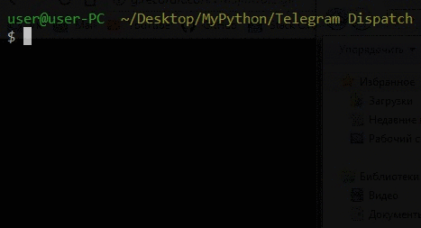
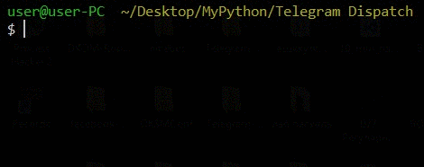

# First start.

At the first start you will be asked to enter the confirmation code and password (if two-factor authorization is active). 
An example is shown below:

# Second start.

With further launches, this is not required.
An example is shown below:

